# 🏗️ ARQUITECTURA TÉCNICA COMPLETA - H₂O ALLEGIANT

## **SISTEMA MULTI-PROYECTO CON AGENTES IA**
### **ADAPTACIÓN DEL SISTEMA EXISTENTE**

---

## 📋 **OVERVIEW DEL SISTEMA**

### **Concepto Central**
H₂O Allegiant es un workspace multi-proyecto donde cada proyecto de agua tiene su propio contexto aislado, gestionado por agentes IA especializados que coordinan automáticamente las 3 fases del MVP:

1. **Propuesta Conceptual** - 30 minutos (EXISTENTE - modern_proposal_agent.py)
2. **Ingeniería Detallada** - 48 horas (NUEVO - DetailedEngineeringAgent)
3. **Procurement Inteligente** - 72 horas (NUEVO - ProcurementAgent)

### **ANÁLISIS DEL SISTEMA ACTUAL**

**YA TENEMOS (REUTILIZAR):**
- ✅ Sistema de login y autenticación
- ✅ `modern_proposal_agent.py` - Agente sofisticado que genera propuestas completas
- ✅ `ai_service.py` - Manejo de chat con cuestionarios dinámicos por sector
- ✅ Base de datos con Users, Conversations, Messages
- ✅ Frontend básico con chat funcional
- ✅ Sistema de pricing con datos históricos

**FALTA PARA MVP:**
- 🔲 Concepto de "Project" como entidad separada de "Conversation"
- 🔲 Dashboard multi-proyecto
- 🔲 Workspace por proyecto individual
- 🔲 Agente de ingeniería detallada (Phase 2)
- 🔲 Agente de procurement (Phase 3)
- 🔲 Progresión entre fases

### **ESTRATEGIA DE MIGRACIÓN GRADUAL**

**PRINCIPIO:** Construir sobre lo existente sin romper nada.

### **MIGRACIÓN: DE CONVERSATIONS A PROJECTS**

**ACTUAL:**
```
User -> Conversation -> Messages + Metadata -> modern_proposal_agent -> PDF
```

**NUEVO (MVP):**
```  
User -> Projects[]
Project -> {
  conversation_id: UUID (fase propuesta - REUTILIZAR EXISTENTE)
  engineering_conversation_id: UUID (opcional, nueva fase)  
  procurement_conversation_id: UUID (opcional, nueva fase)
  status: "proposal" | "engineering" | "procurement"
  context: technical_context (extraído de conversation.metadata)
}
```

### **Arquitectura de Integración**

```
┌─────────────────────────────────────────────────────┐
│                   FRONTEND (EXTENDER)               │
│     Next.js 14 + Dashboard + Workspace Views       │
├─────────────────────────────────────────────────────┤
│                   API LAYER (EXTENDER)              │
│    FastAPI + Project Endpoints + Conversation APIs  │
├─────────────────────────────────────────────────────┤
│                 AGENTS (REUTILIZAR + NUEVOS)        │
│  ┌─────────────┐ ┌─────────────┐ ┌─────────────┐   │
│  │modern_      │ │ Detailed    │ │Procurement  │   │
│  │proposal_    │ │ Engineering │ │  Agent      │   │
│  │agent.py ✅  │ │ Agent 🔲    │ │   🔲        │   │
│  └─────────────┘ └─────────────┘ └─────────────┘   │
├─────────────────────────────────────────────────────┤
│              DATA (EXTENDER EXISTENTE)              │
│  ┌─────────────┐ ┌─────────────┐ ┌─────────────┐   │
│  │ PostgreSQL  │ │   Redis     │ │   S3        │   │
│  │ + Projects  │ │  Sessions   │ │ Documents   │   │
│  │   Model     │ │  + Cache    │ │  + PDFs     │   │
│  └─────────────┘ └─────────────┘ └─────────────┘   │
└─────────────────────────────────────────────────────┘
```

---

## 🗄️ **ESTRUCTURA DE DATOS - MIGRACIÓN GRADUAL**

### **Modelo Project (NUEVO - se integra con Conversation existente)**

```python
# app/db/models/project.py  
from enum import Enum
from sqlalchemy import Column, String, Float, JSON, DateTime, ForeignKey
from sqlalchemy.dialects.postgresql import UUID
from sqlalchemy.orm import relationship

class ProjectStatus(str, Enum):
    PROPOSAL = "proposal"      # Usando modern_proposal_agent existente
    ENGINEERING = "engineering" # Nueva fase
    PROCUREMENT = "procurement" # Nueva fase

class Project(Base):
    __tablename__ = "projects"
    
    # Identificación
    id: UUID = Column(UUID(as_uuid=True), primary_key=True)
    user_id: UUID = Column(UUID(as_uuid=True), ForeignKey("users.id"))
    name: str = Column(String(255), nullable=False)  # Extraído de conversation metadata
    
    # Estado y progreso
    status: ProjectStatus = Column(String(50), default=ProjectStatus.PROPOSAL)
    
    # Referencias a conversaciones por fase (REUTILIZAR EXISTENTE)
    proposal_conversation_id: UUID = Column(UUID(as_uuid=True), ForeignKey("conversations.id"))
    engineering_conversation_id: UUID = Column(UUID(as_uuid=True), ForeignKey("conversations.id"), nullable=True)
    procurement_conversation_id: UUID = Column(UUID(as_uuid=True), ForeignKey("conversations.id"), nullable=True)
    
    # Contexto técnico (EXTRAÍDO de conversation.metadata existente)
    technical_context: dict = Column(JSON, default={})
    """Extraído de la conversation metadata:
    {
        "flow_rate": conversation.metadata.get("flow_rate"),
        "water_type": conversation.metadata.get("water_type"),  
        "location": conversation.metadata.get("user_location"),
        "sector": conversation.metadata.get("selected_sector"),
        "capex_estimated": extraído de proposal_text,
        "proposal_complete": conversation.metadata.get("has_proposal")
    }
    """
    
    # Contextos de fases adicionales (NUEVOS - para agentes futuros)
    engineering_context: dict = Column(JSON, default={})
    """Para DetailedEngineeringAgent:
    {
        "equipment_list": [...],
        "documents_generated": [...],
        "total_cost": 0
    }
    """
    
    procurement_context: dict = Column(JSON, default={})
    """Para ProcurementAgent:
    {
        "equipment_quotes": [...],
        "total_savings": 0,
        "selected_quotes": [...]  
    }
    """
    
    # Metadata
    created_at: datetime = Column(DateTime, default=datetime.utcnow)
    updated_at: datetime = Column(DateTime, default=datetime.utcnow, onupdate=datetime.utcnow)
    
    # Relaciones (INTEGRAR CON EXISTENTE)
    owner = relationship("User", back_populates="projects")
    
    # Relaciones a conversaciones por fase
    proposal_conversation = relationship("Conversation", foreign_keys=[proposal_conversation_id])
    engineering_conversation = relationship("Conversation", foreign_keys=[engineering_conversation_id])  
    procurement_conversation = relationship("Conversation", foreign_keys=[procurement_conversation_id])
```

### **Modificación Mínima a Conversation (OPCIONAL)**

```python
# app/db/models/conversation.py (EXTENDER EXISTENTE)
class Conversation(Base):
    # ... campos existentes ...
    
    # OPCIONAL: Agregar referencia de vuelta  
    project_id: UUID = Column(UUID(as_uuid=True), ForeignKey("projects.id"), nullable=True)
    project = relationship("Project", back_populates="conversations")
```

### **Script de Migración de Datos**

```python
# scripts/migrate_conversations_to_projects.py
async def migrate_existing_conversations():
    """Migrar conversations existentes con propuestas a projects"""
    
    # Buscar conversaciones con propuestas completas
    conversations_with_proposals = await db.execute(
        select(Conversation)
        .where(Conversation.metadata["has_proposal"].astext == "true")
    )
    
    for conv in conversations_with_proposals:
        # Crear Project para cada conversación existente
        project = Project(
            user_id=conv.user_id,
            name=extract_project_name(conv.metadata),  # De metadata o generado
            status=ProjectStatus.PROPOSAL,
            proposal_conversation_id=conv.id,
            technical_context=extract_technical_context(conv.metadata)
        )
        
        db.add(project)
        
        # OPCIONAL: Actualizar conversation con project_id
        conv.project_id = project.id
    
    await db.commit()
```

class ProjectMember(Base):
    __tablename__ = "project_members"
    
    id: UUID = Column(UUID(as_uuid=True), primary_key=True)
    project_id: UUID = Column(UUID(as_uuid=True), ForeignKey("projects.id"))
    user_id: UUID = Column(UUID(as_uuid=True), ForeignKey("users.id"))
    role: str = Column(String(50), default="viewer")  # owner, engineer, viewer
    permissions: list = Column(JSON, default=[])
    invited_at: datetime = Column(DateTime, default=datetime.utcnow)
    
    # Relaciones
    project = relationship("Project", back_populates="team_members")
    user = relationship("User")

class Document(Base):
    __tablename__ = "documents"
    
    id: UUID = Column(UUID(as_uuid=True), primary_key=True)
    project_id: UUID = Column(UUID(as_uuid=True), ForeignKey("projects.id"))
    
    # Metadata del documento
    name: str = Column(String(255))
    type: str = Column(String(50))  # proposal, pid, bom, calculation, layout
    phase: str = Column(String(50))  # proposal, engineering, procurement
    
    # Storage
    file_url: str = Column(String(500))
    file_size: int = Column(Integer)
    mime_type: str = Column(String(100))
    
    # Estado
    status: str = Column(String(50), default="generating")  # generating, completed, error
    metadata: dict = Column(JSON, default={})
    
    created_at: datetime = Column(DateTime, default=datetime.utcnow)
    
    # Relaciones
    project = relationship("Project", back_populates="documents")
```

---

## 🤖 **SISTEMA DE AGENTES - INTEGRACIÓN GRADUAL**

### **ENFOQUE: Reutilizar modern_proposal_agent.py + Crear nuevos agentes**

### **1. Conceptual Engineer Agent (EXISTENTE - REUTILIZAR)**

**ARCHIVO:** `app/agents/modern_proposal_agent.py` ✅

**LO QUE YA HACE PERFECTAMENTE:**
- ✅ Genera propuestas técnicas completas con pydantic-ai
- ✅ Usa herramienta `get_equipment_cost_estimate()` para pricing real
- ✅ Produce output estructurado (`ProposalOutput`)
- ✅ Integra con conversation metadata existente
- ✅ Genera PDF con technical_data

**INTEGRACIÓN CON PROJECTS:**
```python
# app/services/project_service.py
async def complete_proposal_phase(project_id: UUID) -> Dict[str, Any]:
    """Completa fase de propuesta usando agente existente"""
    
    project = await get_project(project_id)
    conversation = await get_conversation(project.proposal_conversation_id)
    
    # REUTILIZAR modern_proposal_agent existente
    from app.agents.modern_proposal_agent import intelligent_proposal_generator
    
    # Extraer contexto de la conversación existente
    conversation_context = extract_conversation_context(conversation)
    client_metadata = conversation.metadata
    
    # Generar propuesta (SIN CAMBIOS al agente)
    proposal_output = await intelligent_proposal_generator.generate_proposal(
        conversation_context, 
        client_metadata
    )
    
    # Actualizar project con contexto técnico
    project.technical_context = {
        "capex_estimated": proposal_output.technical_data.capex_usd,
        "flow_rate": proposal_output.technical_data.flow_rate_m3_day,
        "equipment_list": proposal_output.technical_data.main_equipment,
        # ... extraer más datos del proposal_output
    }
    
    project.status = ProjectStatus.PROPOSAL
    await update_project(project)
    
    return {
        "proposal_pdf": proposal_output.proposal_pdf_url,
        "technical_context": project.technical_context
    }
```

**NO CAMBIAR NADA EN:** `modern_proposal_agent.py` - Ya es perfecto

```python
# app/agents/conceptual_engineer.py
from .base_agent import BaseProjectAgent
from langchain_openai import ChatOpenAI
from langchain_core.prompts import ChatPromptTemplate

class ConceptualEngineerAgent(BaseProjectAgent):
    def __init__(self, project_id: UUID, conversation_history: List[Dict]):
        super().__init__(project_id, {"conversation": conversation_history})
        self.llm = ChatOpenAI(model="gpt-4o", temperature=0.1)
        
    async def execute(self) -> Dict[str, Any]:
        await self.update_progress(0, "Analizando requerimientos...")
        
        # 1. Extraer especificaciones técnicas
        technical_specs = await self._extract_technical_specs()
        await self.update_progress(25, "Especificaciones extraídas")
        
        # 2. Generar propuesta conceptual
        proposal_content = await self._generate_proposal(technical_specs)
        await self.update_progress(50, "Propuesta generada")
        
        # 3. Generar PDF
        pdf_url = await self._generate_pdf(proposal_content)
        await self.update_progress(75, "Documento generado")
        
        # 4. Guardar contexto para siguiente fase
        context = await self._prepare_engineering_context(technical_specs)
        await self.update_progress(100, "Propuesta completa")
        
        return {
            "proposal_pdf": pdf_url,
            "technical_context": context,
            "capex_estimated": technical_specs.get("capex_estimated", 0),
            "timeline_days": technical_specs.get("timeline_days", 90)
        }
        
    async def _extract_technical_specs(self) -> Dict[str, Any]:
        prompt = ChatPromptTemplate.from_template("""
        Extrae las especificaciones técnicas de esta conversación:
        
        Conversación: {conversation}
        
        Devuelve un JSON con:
        - flow_rate (número)
        - flow_rate_unit (string)
        - water_type (industrial/municipal/agricultural)
        - location (string)
        - treatment_type (string)
        - capex_estimated (número)
        - timeline_days (número)
        - special_requirements (lista)
        """)
        
        response = await self.llm.ainvoke(
            prompt.format(conversation=self.context["conversation"])
        )
        
        return json.loads(response.content)
```

### **2. Detailed Designer Agent (Nuevo)**

```python
# app/agents/detailed_designer.py
from .base_agent import BaseProjectAgent
from langgraph.graph import StateGraph, END
from langchain_openai import ChatOpenAI
import asyncio

class DetailedDesignerAgent(BaseProjectAgent):
    def __init__(self, project_id: UUID, technical_context: Dict[str, Any]):
        super().__init__(project_id, technical_context)
        self.llm = ChatOpenAI(model="gpt-4o", temperature=0.1)
        
    async def execute(self) -> Dict[str, Any]:
        """Ejecuta workflow de ingeniería usando LangGraph"""
        
        # Crear workflow de ingeniería
        workflow = self._create_engineering_workflow()
        
        # Estado inicial
        initial_state = {
            "project_id": self.project_id,
            "technical_context": self.context,
            "documents": [],
            "equipment_list": [],
            "progress": 0
        }
        
        # Ejecutar workflow
        final_state = await workflow.ainvoke(initial_state)
        
        return {
            "documents": final_state["documents"],
            "equipment_list": final_state["equipment_list"],
            "engineering_context": final_state["engineering_context"],
            "total_cost": final_state["total_cost"]
        }
        
    def _create_engineering_workflow(self) -> StateGraph:
        """Crea workflow de LangGraph para ingeniería"""
        
        workflow = StateGraph(dict)
        
        # Nodos del workflow
        workflow.add_node("extract_specs", self._extract_detailed_specs)
        workflow.add_node("generate_pid", self._generate_pid)
        workflow.add_node("create_equipment_list", self._create_equipment_list)
        workflow.add_node("generate_calculations", self._generate_calculations)
        workflow.add_node("create_layout", self._create_layout)
        workflow.add_node("finalize_documents", self._finalize_documents)
        
        # Flujo del workflow
        workflow.add_edge("extract_specs", "generate_pid")
        workflow.add_edge("generate_pid", "create_equipment_list") 
        workflow.add_edge("create_equipment_list", "generate_calculations")
        workflow.add_edge("generate_calculations", "create_layout")
        workflow.add_edge("create_layout", "finalize_documents")
        workflow.add_edge("finalize_documents", END)
        
        workflow.set_entry_point("extract_specs")
        
        return workflow.compile()
        
    async def _extract_detailed_specs(self, state: dict) -> dict:
        await self.update_progress(10, "Extrayendo especificaciones detalladas...")
        
        # Usar LLM para extraer specs más detalladas
        detailed_specs = await self._analyze_requirements(state["technical_context"])
        
        state["detailed_specs"] = detailed_specs
        state["progress"] = 20
        return state
        
    async def _generate_pid(self, state: dict) -> dict:
        await self.update_progress(30, "Generando P&ID principal...")
        
        # Generar P&ID usando plantillas + LLM
        pid_data = await self._create_pid_from_specs(state["detailed_specs"])
        
        # Guardar documento
        doc_url = await self._save_document("pid", pid_data, "P&ID Principal")
        
        state["documents"].append({
            "type": "pid",
            "name": "P&ID Principal", 
            "url": doc_url,
            "status": "completed"
        })
        state["progress"] = 50
        return state
        
    async def _create_equipment_list(self, state: dict) -> dict:
        await self.update_progress(60, "Creando lista de equipos...")
        
        # Extraer equipos del P&ID y especificar
        equipment_list = await self._extract_equipment_from_pid(state["detailed_specs"])
        
        state["equipment_list"] = equipment_list
        state["progress"] = 75
        return state
        
    async def _generate_calculations(self, state: dict) -> dict:
        await self.update_progress(85, "Generando memorias de cálculo...")
        
        # Generar cálculos para cada equipo
        calculations = await self._create_calculations(state["equipment_list"])
        
        doc_url = await self._save_document("calculations", calculations, "Memorias de Cálculo")
        
        state["documents"].append({
            "type": "calculations",
            "name": "Memorias de Cálculo",
            "url": doc_url, 
            "status": "completed"
        })
        return state
        
    async def _create_layout(self, state: dict) -> dict:
        await self.update_progress(95, "Creando layout preliminar...")
        
        # Generar layout básico
        layout_data = await self._generate_layout(state["equipment_list"])
        
        doc_url = await self._save_document("layout", layout_data, "Layout Preliminar")
        
        state["documents"].append({
            "type": "layout",
            "name": "Layout Preliminar",
            "url": doc_url,
            "status": "completed"
        })
        return state
        
    async def _finalize_documents(self, state: dict) -> dict:
        await self.update_progress(100, "Ingeniería completa")
        
        # Preparar contexto para procurement
        state["engineering_context"] = {
            "equipment_list": state["equipment_list"],
            "total_equipment_cost": sum(eq["estimated_cost"] for eq in state["equipment_list"]),
            "documents_generated": state["documents"]
        }
        
        return state
```

### **3. Procurement Agent (Nuevo)**

```python
# app/agents/procurement_agent.py
from .base_agent import BaseProjectAgent
from openai import AsyncOpenAI
import asyncio
from typing import List, Dict

class ProcurementAgent(BaseProjectAgent):
    def __init__(self, project_id: UUID, equipment_list: List[Dict]):
        super().__init__(project_id, {"equipment_list": equipment_list})
        self.openai_client = AsyncOpenAI()
        
    async def execute(self) -> Dict[str, Any]:
        """Busca cotizaciones para todos los equipos"""
        
        equipment_list = self.context["equipment_list"]
        total_equipment = len(equipment_list)
        
        equipment_quotes = []
        
        for i, equipment in enumerate(equipment_list):
            await self.update_progress(
                (i / total_equipment) * 80, 
                f"Buscando cotizaciones para {equipment['name']}..."
            )
            
            # Buscar cotizaciones para este equipo
            quotes = await self._search_equipment_quotes(equipment)
            
            equipment_quotes.append({
                "equipment_id": equipment["id"],
                "equipment_name": equipment["name"],
                "quotes": quotes,
                "selected_quote": None,
                "estimated_cost": equipment["estimated_cost"]
            })
            
        await self.update_progress(90, "Analizando mejores opciones...")
        
        # Calcular ahorros potenciales
        total_savings = self._calculate_savings(equipment_quotes)
        
        await self.update_progress(100, f"Encontré ${total_savings:,.0f} en ahorros potenciales")
        
        return {
            "equipment_quotes": equipment_quotes,
            "total_savings": total_savings,
            "procurement_status": "quotes_ready"
        }
        
    async def _search_equipment_quotes(self, equipment: Dict) -> List[Dict]:
        """Busca cotizaciones usando multiple sources"""
        
        quotes = []
        
        # 1. MCP Connectors (APIs de proveedores)
        mcp_quotes = await self._search_via_mcp(equipment)
        quotes.extend(mcp_quotes)
        
        # 2. ChatGPT Agent para web search
        web_quotes = await self._search_via_chatgpt_agent(equipment)
        quotes.extend(web_quotes)
        
        # 3. Email RFQs automáticos
        email_quotes = await self._send_automated_rfqs(equipment)
        quotes.extend(email_quotes)
        
        # 4. Base de datos histórica
        historical_quotes = await self._search_historical_data(equipment)
        quotes.extend(historical_quotes)
        
        # Ranking y limitar a top 3
        ranked_quotes = self._rank_quotes(quotes)
        return ranked_quotes[:3]
        
    async def _search_via_mcp(self, equipment: Dict) -> List[Dict]:
        """Buscar via MCP connectors (Grainger, etc)"""
        # Implementar búsqueda via MCP
        pass
        
    async def _search_via_chatgpt_agent(self, equipment: Dict) -> List[Dict]:
        """Usar ChatGPT Agent para búsqueda web"""
        
        # Crear assistant especializado en procurement
        assistant = await self.openai_client.beta.assistants.create(
            name="Procurement Specialist",
            instructions=f"""
            Eres un especialista en compras industriales de equipos de tratamiento de agua.
            
            Tu tarea: Encontrar las mejores 3 cotizaciones para este equipo:
            {equipment}
            
            Busca en:
            - Sitios web de proveedores industriales
            - Catálogos online
            - Marketplaces B2B
            
            Para cada cotización encontrada, devuelve:
            - supplier: Nombre del proveedor
            - price: Precio en USD
            - delivery_time: Tiempo de entrega en días
            - specifications: Especificaciones que cumple
            - contact_info: Información de contacto
            - source_url: URL donde encontraste la información
            
            Formato de respuesta: JSON array
            """,
            tools=[
                {"type": "web_search"},
                {"type": "code_interpreter"}
            ],
            model="gpt-4o"
        )
        
        # Crear thread y ejecutar búsqueda
        thread = await self.openai_client.beta.threads.create()
        
        await self.openai_client.beta.threads.messages.create(
            thread_id=thread.id,
            role="user",
            content=f"Busca cotizaciones para: {equipment['name']} - {equipment['specifications']}"
        )
        
        run = await self.openai_client.beta.threads.runs.create(
            thread_id=thread.id,
            assistant_id=assistant.id
        )
        
        # Esperar resultado
        while run.status in ['queued', 'in_progress']:
            await asyncio.sleep(2)
            run = await self.openai_client.beta.threads.runs.retrieve(
                thread_id=thread.id,
                run_id=run.id
            )
        
        # Obtener respuesta
        messages = await self.openai_client.beta.threads.messages.list(thread_id=thread.id)
        
        # Parsear respuesta JSON
        response_text = messages.data[0].content[0].text.value
        quotes = json.loads(response_text)
        
        return quotes
```

---

## 🔄 **COMUNICACIÓN DE DATOS EN TIEMPO REAL**

### **WebSocket Architecture**

```python
# app/websockets/project_updates.py
from fastapi import WebSocket, WebSocketDisconnect
from typing import Dict, Set
import json
import asyncio

class ProjectConnectionManager:
    def __init__(self):
        # project_id -> Set[WebSocket]
        self.active_connections: Dict[str, Set[WebSocket]] = {}
        
    async def connect(self, websocket: WebSocket, project_id: str):
        await websocket.accept()
        if project_id not in self.active_connections:
            self.active_connections[project_id] = set()
        self.active_connections[project_id].add(websocket)
        
    def disconnect(self, websocket: WebSocket, project_id: str):
        if project_id in self.active_connections:
            self.active_connections[project_id].discard(websocket)
            
    async def broadcast_to_project(self, project_id: str, message: dict):
        if project_id in self.active_connections:
            dead_connections = set()
            for connection in self.active_connections[project_id]:
                try:
                    await connection.send_text(json.dumps(message))
                except:
                    dead_connections.add(connection)
            
            # Limpiar conexiones muertas
            for dead_conn in dead_connections:
                self.active_connections[project_id].discard(dead_conn)

manager = ProjectConnectionManager()

@app.websocket("/ws/projects/{project_id}")
async def websocket_endpoint(websocket: WebSocket, project_id: str):
    await manager.connect(websocket, project_id)
    try:
        while True:
            # Mantener conexión viva
            await websocket.receive_text()
    except WebSocketDisconnect:
        manager.disconnect(websocket, project_id)

# Función global para broadcast
async def broadcast_progress(project_id: str, progress_data: dict):
    await manager.broadcast_to_project(project_id, {
        "type": "progress_update",
        "data": progress_data
    })

async def broadcast_phase_complete(project_id: str, phase: str, results: dict):
    await manager.broadcast_to_project(project_id, {
        "type": "phase_complete",
        "phase": phase,
        "data": results
    })
```

### **Sistema de Events**

```python
# app/events/project_events.py
from typing import Dict, Any, Callable, List
import asyncio
from enum import Enum

class ProjectEventType(str, Enum):
    PROPOSAL_STARTED = "proposal.started"
    PROPOSAL_COMPLETED = "proposal.completed"
    ENGINEERING_STARTED = "engineering.started"
    ENGINEERING_PROGRESS = "engineering.progress"
    ENGINEERING_COMPLETED = "engineering.completed"
    PROCUREMENT_STARTED = "procurement.started" 
    PROCUREMENT_QUOTES_READY = "procurement.quotes_ready"
    PROCUREMENT_COMPLETED = "procurement.completed"
    PAYMENT_COMPLETED = "payment.completed"

class ProjectEventBus:
    def __init__(self):
        self.listeners: Dict[ProjectEventType, List[Callable]] = {}
        
    def subscribe(self, event_type: ProjectEventType, callback: Callable):
        if event_type not in self.listeners:
            self.listeners[event_type] = []
        self.listeners[event_type].append(callback)
        
    async def emit(self, event_type: ProjectEventType, project_id: str, data: Dict[str, Any]):
        if event_type in self.listeners:
            tasks = []
            for callback in self.listeners[event_type]:
                tasks.append(callback(project_id, data))
            await asyncio.gather(*tasks, return_exceptions=True)

# Instance global
event_bus = ProjectEventBus()

# Event handlers
async def handle_proposal_completed(project_id: str, data: Dict[str, Any]):
    """Cuando se completa propuesta, actualizar DB y UI"""
    
    # 1. Actualizar base de datos
    await update_project_phase(project_id, "proposal", 100)
    await save_technical_context(project_id, data["technical_context"])
    
    # 2. Broadcast a UI
    await broadcast_phase_complete(project_id, "proposal", data)
    
    # 3. Trigger next phase si está pagado
    project = await get_project(project_id)
    if project.payments["engineering"]["status"] == "completed":
        await start_engineering_phase(project_id)

async def handle_engineering_completed(project_id: str, data: Dict[str, Any]):
    """Cuando se completa ingeniería, preparar procurement"""
    
    # 1. Actualizar contexto de ingeniería
    await update_engineering_context(project_id, data["engineering_context"])
    
    # 2. Broadcast completion
    await broadcast_phase_complete(project_id, "engineering", data)
    
    # 3. Auto-start procurement si está pagado
    project = await get_project(project_id)
    if project.payments["procurement"]["status"] == "completed":
        await start_procurement_phase(project_id, data["equipment_list"])

# Registrar handlers
event_bus.subscribe(ProjectEventType.PROPOSAL_COMPLETED, handle_proposal_completed)
event_bus.subscribe(ProjectEventType.ENGINEERING_COMPLETED, handle_engineering_completed)
```

---

## 🔌 **MCP CONNECTORS**

### **Estructura de MCP**

```python
# app/mcp/base_connector.py
from abc import ABC, abstractmethod
from typing import Dict, Any, List

class BaseMCPConnector(ABC):
    def __init__(self, config: Dict[str, Any]):
        self.config = config
        self.name = self.__class__.__name__
        
    @abstractmethod
    async def search_equipment(self, query: Dict[str, Any]) -> List[Dict[str, Any]]:
        """Buscar equipos en el proveedor"""
        pass
        
    @abstractmethod
    async def get_product_details(self, product_id: str) -> Dict[str, Any]:
        """Obtener detalles de un producto específico"""
        pass

# app/mcp/grainger_connector.py
class GraingerMCPConnector(BaseMCPConnector):
    def __init__(self):
        super().__init__({
            "api_key": os.getenv("GRAINGER_API_KEY"),
            "base_url": "https://api.grainger.com/v2"
        })
        
    async def search_equipment(self, query: Dict[str, Any]) -> List[Dict[str, Any]]:
        """
        query = {
            "name": "DAF System",
            "specifications": {
                "flow_rate": 500,
                "material": "stainless_steel"
            },
            "category": "water_treatment"
        }
        """
        
        # Transformar query a formato Grainger
        search_params = self._transform_query(query)
        
        # Hacer request a API
        response = await self._api_request("/search", search_params)
        
        # Normalizar respuesta
        products = []
        for item in response.get("products", []):
            products.append({
                "supplier": "Grainger",
                "product_id": item["id"],
                "name": item["name"],
                "price": item["price"]["value"],
                "currency": item["price"]["currency"],
                "delivery_time": item.get("delivery_days", 30),
                "specifications": item.get("specifications", {}),
                "url": item.get("product_url"),
                "score": self._calculate_match_score(query, item)
            })
            
        return sorted(products, key=lambda x: x["score"], reverse=True)

# app/mcp/email_rfq_connector.py  
class EmailRFQConnector(BaseMCPConnector):
    def __init__(self):
        super().__init__({
            "smtp_server": os.getenv("SMTP_SERVER"),
            "email_templates": load_email_templates()
        })
        
    async def search_equipment(self, query: Dict[str, Any]) -> List[Dict[str, Any]]:
        """Enviar RFQs automáticos y procesar respuestas"""
        
        # 1. Identificar proveedores relevantes
        suppliers = await self._find_relevant_suppliers(query)
        
        # 2. Generar RFQ personalizado
        rfq_content = await self._generate_rfq(query)
        
        # 3. Enviar emails
        sent_rfqs = []
        for supplier in suppliers:
            email_sent = await self._send_rfq_email(supplier, rfq_content)
            if email_sent:
                sent_rfqs.append({
                    "supplier": supplier["name"],
                    "email": supplier["email"],
                    "sent_at": datetime.utcnow(),
                    "rfq_id": str(uuid4())
                })
                
        # 4. Devolver RFQs enviados (respuestas se procesan async)
        return [{
            "supplier": rfq["supplier"],
            "status": "rfq_sent",
            "price": None,  # Se actualizará cuando respondan
            "delivery_time": None,
            "rfq_id": rfq["rfq_id"],
            "score": 50  # Score neutro para RFQs
        } for rfq in sent_rfqs]

# app/mcp/connector_registry.py
class MCPConnectorRegistry:
    def __init__(self):
        self.connectors = {}
        self._register_default_connectors()
        
    def _register_default_connectors(self):
        self.connectors["grainger"] = GraingerMCPConnector()
        self.connectors["email_rfq"] = EmailRFQConnector()
        # self.connectors["alibaba"] = AlibabaMCPConnector()
        # self.connectors["thomasnet"] = ThomasNetMCPConnector()
        
    async def search_all_sources(self, query: Dict[str, Any]) -> List[Dict[str, Any]]:
        """Buscar en todos los conectores en paralelo"""
        
        tasks = []
        for name, connector in self.connectors.items():
            tasks.append(connector.search_equipment(query))
            
        results = await asyncio.gather(*tasks, return_exceptions=True)
        
        # Consolidar resultados
        all_products = []
        for i, result in enumerate(results):
            if isinstance(result, list):
                all_products.extend(result)
            else:
                # Log error pero continuar
                logger.error(f"Error in connector {list(self.connectors.keys())[i]}: {result}")
                
        return all_products

# Instance global
mcp_registry = MCPConnectorRegistry()
```

---

## 🎨 **ESTRUCTURA FRONTEND**

### **Arquitectura de Componentes**

```typescript
// hydrous-chat/src/types/project.ts
export interface Project {
  id: string;
  name: string;
  description: string;
  status: ProjectStatus;
  currentPhase: ProjectPhase;
  phaseProgress: {
    proposal: number;
    engineering: number;
    procurement: number;
  };
  technicalContext: TechnicalContext;
  engineeringContext?: EngineeringContext;
  procurementContext?: ProcurementContext;
  payments: PaymentStatus;
  createdAt: string;
  updatedAt: string;
}

export interface TechnicalContext {
  flowRate: number;
  flowRateUnit: string;
  waterType: string;
  location: string;
  treatmentType: string;
  capexEstimated: number;
  timelineDays: number;
}

export interface EngineeringContext {
  equipmentList: Equipment[];
  totalEquipmentCost: number;
  documentsGenerated: Document[];
}

export interface ProcurementContext {
  equipmentQuotes: EquipmentQuote[];
  totalSavings: number;
  procurementStatus: string;
}
```

### **Dashboard Multi-Proyecto**

```typescript
// hydrous-chat/src/app/dashboard/page.tsx
'use client';

import { useState, useEffect } from 'react';
import { useProjects } from '@/hooks/useProjects';
import { ProjectCard } from '@/components/projects/ProjectCard';
import { ProjectStats } from '@/components/projects/ProjectStats';
import { CreateProjectModal } from '@/components/projects/CreateProjectModal';

export default function Dashboard() {
  const { projects, loading, createProject } = useProjects();
  const [showCreateModal, setShowCreateModal] = useState(false);

  return (
    <div className="max-w-7xl mx-auto px-4 py-8">
      {/* Header */}
      <div className="flex justify-between items-center mb-8">
        <div>
          <h1 className="text-3xl font-bold">Mis Proyectos</h1>
          <p className="text-gray-600 mt-2">
            Gestiona todos tus proyectos de agua en un solo lugar
          </p>
        </div>
        <button 
          onClick={() => setShowCreateModal(true)}
          className="bg-blue-600 text-white px-6 py-3 rounded-lg hover:bg-blue-700"
        >
          + Crear Proyecto
        </button>
      </div>

      {/* Stats Overview */}
      <ProjectStats projects={projects} />

      {/* Actions Required */}
      <ActionsRequired projects={projects} />

      {/* Projects Grid */}
      <div className="grid grid-cols-1 md:grid-cols-2 lg:grid-cols-3 gap-6">
        {projects.map(project => (
          <ProjectCard 
            key={project.id} 
            project={project}
            onNavigate={(projectId) => router.push(`/projects/${projectId}`)}
          />
        ))}
      </div>

      {/* Create Project Modal */}
      <CreateProjectModal 
        isOpen={showCreateModal}
        onClose={() => setShowCreateModal(false)}
        onCreateProject={createProject}
      />
    </div>
  );
}
```

### **Workspace Individual**

```typescript
// hydrous-chat/src/app/projects/[projectId]/page.tsx
'use client';

import { useProject } from '@/hooks/useProject';
import { useWebSocket } from '@/hooks/useWebSocket';
import { ProjectHeader } from '@/components/projects/ProjectHeader';
import { ProjectTimeline } from '@/components/projects/ProjectTimeline';
import { ProjectActions } from '@/components/projects/ProjectActions';
import { ProgressUpdates } from '@/components/projects/ProgressUpdates';

export default function ProjectWorkspace({ params }: { params: { projectId: string } }) {
  const { project, loading, updateProject } = useProject(params.projectId);
  const { updates, isConnected } = useWebSocket(params.projectId);

  if (loading) return <ProjectSkeleton />;
  if (!project) return <ProjectNotFound />;

  return (
    <div className="max-w-7xl mx-auto px-4 py-8">
      {/* Project Header */}
      <ProjectHeader project={project} />
      
      {/* Main Content */}
      <div className="grid grid-cols-1 lg:grid-cols-3 gap-8 mt-8">
        
        {/* Left Column - Main Content */}
        <div className="lg:col-span-2 space-y-6">
          
          {/* Timeline & Progress */}
          <ProjectTimeline 
            project={project}
            realTimeUpdates={updates}
          />
          
          {/* Current Phase Actions */}
          <ProjectActions 
            project={project}
            onAction={updateProject}
          />
          
          {/* Documents */}
          <ProjectDocuments project={project} />
          
        </div>
        
        {/* Right Column - Sidebar */}
        <div className="space-y-6">
          
          {/* Progress Updates */}
          <ProgressUpdates 
            updates={updates}
            isConnected={isConnected}
          />
          
          {/* Quick Actions */}
          <QuickActions project={project} />
          
          {/* Project Team */}
          <ProjectTeam project={project} />
          
        </div>
      </div>
    </div>
  );
}
```

### **Real-time Updates Hook**

```typescript
// hydrous-chat/src/hooks/useWebSocket.ts
import { useEffect, useState, useRef } from 'react';

interface ProgressUpdate {
  agent: string;
  progress: number;
  message: string;
  timestamp: string;
}

interface WebSocketMessage {
  type: 'progress_update' | 'phase_complete' | 'error';
  data: any;
}

export function useWebSocket(projectId: string) {
  const [updates, setUpdates] = useState<ProgressUpdate[]>([]);
  const [isConnected, setIsConnected] = useState(false);
  const ws = useRef<WebSocket | null>(null);

  useEffect(() => {
    // Conectar WebSocket
    ws.current = new WebSocket(`ws://localhost:8000/ws/projects/${projectId}`);
    
    ws.current.onopen = () => {
      setIsConnected(true);
    };
    
    ws.current.onmessage = (event) => {
      const message: WebSocketMessage = JSON.parse(event.data);
      
      if (message.type === 'progress_update') {
        setUpdates(prev => [...prev.slice(-9), message.data]); // Keep last 10
      } else if (message.type === 'phase_complete') {
        // Handle phase completion
        setUpdates(prev => [...prev, {
          agent: 'System',
          progress: 100,
          message: `${message.phase} completado`,
          timestamp: new Date().toISOString()
        }]);
      }
    };
    
    ws.current.onclose = () => {
      setIsConnected(false);
    };
    
    // Cleanup
    return () => {
      ws.current?.close();
    };
  }, [projectId]);

  return { updates, isConnected };
}
```

---

## 📋 **PLAN DE IMPLEMENTACIÓN ESPECÍFICO**

### **SEMANA 1: BASE MULTI-PROYECTO (Fundación)**

**BACKEND:**
- [ ] Crear `app/db/models/project.py` - Modelo Project básico
- [ ] Migration para crear tabla projects
- [ ] `app/services/project_service.py` - CRUD básico de proyectos
- [ ] `app/routes/projects.py` - API endpoints básicos
- [ ] Script migración: convertir conversations existentes a projects

**FRONTEND:**  
- [ ] `hydrous-chat/src/app/dashboard/page.tsx` - Dashboard que liste proyectos
- [ ] Componente ProjectCard para mostrar resumen de cada proyecto
- [ ] Navigation entre dashboard y chat existente

**INTEGRACIÓN:**
- [ ] Modificar `app/routes/chat.py` para crear Project cuando conversation tenga propuesta
- [ ] Endpoint para migrar conversations existentes a projects

### **SEMANA 2: WORKSPACE INDIVIDUAL (Visualización)**

**FRONTEND:**
- [ ] `hydrous-chat/src/app/projects/[id]/page.tsx` - Workspace del proyecto
- [ ] Mostrar información extraída de conversation.metadata
- [ ] Integrar chat existente dentro del workspace
- [ ] Timeline básico mostrando progreso de las fases

**BACKEND:**
- [ ] Endpoints para obtener detalles completos del proyecto
- [ ] Lógica para extraer contexto técnico de conversations
- [ ] API para obtener documentos generados (PDFs existentes)

### **SEMANA 3: SEGUNDA FASE - INGENIERÍA (Nuevo Agente)**

**NUEVO AGENTE:**
- [ ] `app/agents/detailed_engineering_agent.py` - Siguiendo patrón de modern_proposal_agent
- [ ] Usar pydantic-ai para generar P&IDs, BOMs, especificaciones
- [ ] Integrar con technical_context del proyecto

**BACKEND:**
- [ ] Lógica para activar fase engineering
- [ ] Endpoint para iniciar ingeniería detallada
- [ ] Progress tracking (mock inicial)

**FRONTEND:**
- [ ] UI para mostrar progreso de engineering
- [ ] Vista de documentos de ingeniería generados

### **SEMANA 4: TERCERA FASE - PROCUREMENT (Agente de Compras)**

**NUEVO AGENTE:**
- [ ] `app/agents/procurement_agent.py` - Búsqueda básica de proveedores
- [ ] Mock de cotizaciones y comparación
- [ ] Output estructurado similar a modern_proposal_agent

**FRONTEND:**
- [ ] Wizard de selección de equipos
- [ ] Tabla de comparación de opciones
- [ ] Flow completo de las 3 fases

**INTEGRACIÓN COMPLETA:**
- [ ] Flow completo: Propuesta → Ingeniería → Procurement
- [ ] Testing end-to-end del MVP

---

## 🚀 **FLUJO COMPLETO DE EJECUCIÓN**

### **1. Usuario Crea Proyecto**

```mermaid
sequenceDiagram
    participant U as Usuario
    participant F as Frontend
    participant API as FastAPI
    participant DB as PostgreSQL
    participant A as ConceptualAgent

    U->>F: Crear Proyecto + Conversar
    F->>API: POST /projects + conversación
    API->>DB: Crear proyecto (status: proposal)
    API->>A: Ejecutar ConceptualAgent
    A-->>API: Progress updates via WebSocket
    API-->>F: Real-time progress
    A->>API: Propuesta completa
    API->>DB: Guardar technical_context
    API->>F: Propuesta PDF + opción pago
```



### **2. Usuario Paga Ingeniería**

```mermaid
sequenceDiagram
    participant U as Usuario  
    participant F as Frontend
    participant API as FastAPI
    participant S as Stripe
    participant A as EngineeringAgent
    participant DB as PostgreSQL

    U->>F: Proceder con Ingeniería
    F->>API: POST /payments/engineering-intent
    API->>S: Crear PaymentIntent
    S->>API: client_secret
    API->>F: client_secret
    F->>S: Procesar pago
    S->>API: Webhook payment_succeeded
    API->>A: Iniciar DetailedDesignerAgent
    A-->>API: Progress updates (P&ID, BOM, etc)
    A->>API: Ingeniería completa
    API->>DB: Guardar engineering_context
```



### **3. Usuario Inicia Procurement**

```mermaid
sequenceDiagram
    participant U as Usuario
    participant F as Frontend  
    participant API as FastAPI
    participant P as ProcurementAgent
    participant MCP as MCP Connectors
    participant E as External APIs

    U->>F: Iniciar Procurement
    F->>API: POST /payments/procurement-intent
    Note over API: Pago procesado...
    API->>P: Iniciar ProcurementAgent
    P->>MCP: Buscar equipos en paralelo
    MCP->>E: Grainger, Email RFQs, etc.
    E->>MCP: Cotizaciones
    MCP->>P: Cotizaciones consolidadas
    P->>API: Equipos con opciones
    API->>F: Wizard de selección
    U->>F: Seleccionar equipos
    F->>API: Confirmar selección
    API->>P: Generar órdenes de compra
```



---

## 📋 **PLAN DE IMPLEMENTACIÓN**

### **Fase 1: Foundation (Semanas 1-2)**

**Backend:**
- [ ] Extender modelos de datos (Project, ProjectMember, Document)
- [ ] API routes para multi-proyecto (/projects, /projects/{id})
- [ ] WebSocket infrastructure
- [ ] Event bus system
- [ ] Payment integration básica

**Frontend:**
- [ ] Dashboard multi-proyecto
- [ ] Project workspace layout
- [ ] WebSocket hooks para real-time
- [ ] Navigation entre proyectos

### **Fase 2: Agents (Semanas 3-4)**

**Agents:**
- [ ] Refactor ConceptualEngineerAgent
- [ ] Implementar DetailedDesignerAgent con LangGraph
- [ ] Base architecture para ProcurementAgent
- [ ] Progress tracking system

**UI:**
- [ ] Progress visualization components
- [ ] Phase-specific action buttons
- [ ] Document viewer/downloader

### **Fase 3: Procurement (Semanas 5-6)**

**Procurement:**
- [ ] MCP connector framework
- [ ] Grainger API connector
- [ ] Email RFQ automation
- [ ] ChatGPT Agent integration
- [ ] Equipment comparison UI

**Frontend:**
- [ ] Procurement wizard
- [ ] Equipment comparison table
- [ ] Selection and checkout flow

### **Fase 4: Polish (Semanas 7-8)**

**Final:**
- [ ] Error handling & recovery
- [ ] Performance optimization
- [ ] User testing & feedback
- [ ] Deployment preparation

---

## 🔐 **SEGURIDAD Y CONSIDERACIONES**

### **Authentication & Authorization**
- JWT tokens para API authentication
- Role-based permissions por proyecto
- Rate limiting por usuario y proyecto

### **Data Security**
- Encriptación de datos sensibles en DB
- Secure file storage en S3
- Audit logs de todas las acciones

### **AI Safety**
- Input validation en todos los agents
- Output sanitization
- Human review option para documentos críticos
- Clear disclaimers sobre responsabilidad

### **Error Handling**
- Graceful degradation cuando APIs fallan
- Retry logic con exponential backoff
- Detailed error logging sin exponer datos sensibles

---

## 🎯 **RESUMEN EJECUTIVO - QUE TENEMOS VS QUE FALTA**

### **FOUNDATION SÓLIDA (YA TENEMOS)** ✅
- **Sistema de autenticación completo** - Users, sessions, JWT
- **modern_proposal_agent.py** - Agente sofisticado con pydantic-ai que genera propuestas técnicas completas
- **ai_service.py** - Chat inteligente con cuestionarios dinámicos por sector  
- **Base de datos robusta** - PostgreSQL con Conversations, Messages, Users
- **Frontend básico funcional** - Next.js con chat integrado
- **Sistema de pricing** - Datos históricos reales de equipos

### **GAPS PARA MVP MULTI-PROYECTO** 🔲

**SEMANA 1-2: FOUNDATION**
- 🔲 Modelo Project que "envuelva" Conversations existentes
- 🔲 Dashboard multi-proyecto 
- 🔲 Workspace individual por proyecto
- 🔲 Migración de conversations existentes a projects

**SEMANA 3: PHASE 2 AGENT**  
- 🔲 DetailedEngineeringAgent (siguiendo patrón de modern_proposal_agent)
- 🔲 Generación de P&IDs, BOMs, especificaciones técnicas
- 🔲 UI para mostrar progreso de ingeniería

**SEMANA 4: PHASE 3 AGENT**
- 🔲 ProcurementAgent básico (mock inicial)  
- 🔲 Wizard de selección de equipos
- 🔲 Integración completa de las 3 fases

### **ESTRATEGIA CLAVE: MIGRACIÓN SIN RUPTURA** 🎯

1. **REUTILIZAR TODO** lo que ya funciona perfectamente
2. **EXTENDER GRADUALMENTE** sin cambiar código existente  
3. **MIGRAR DATOS** automáticamente sin pérdida
4. **MANTENER COMPATIBILIDAD** con usuarios actuales
5. **CONSTRUIR SOBRE BASE SÓLIDA** que ya está probada

### **RESULTADO FINAL**
- ✅ **Sistema multi-proyecto funcional** en 4 semanas
- ✅ **Agentes coordinados** para las 3 fases del MVP
- ✅ **Zero downtime** - usuarios actuales siguen funcionando
- ✅ **Base escalable** para fases futuras (logistics, installation, operations)

---

Este documento define la arquitectura técnica completa para adaptar el sistema existente de H₂O Allegiant al modelo multi-proyecto con agentes IA coordinados. La implementación reutiliza la base sólida existente y la extiende gradualmente sin romper funcionalidad actual.